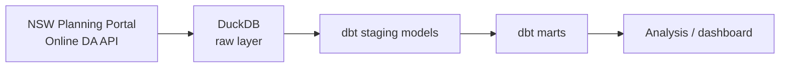

# Planning Pulse NSW

**Live dashboard**: https://planning-pulse-nsw-fmfmcclnd6pax2c5qfdr3q.streamlit.app/

Planning Pulse NSW turns publicly available NSW Planning Portal development-application (DA) data into a reproducible, well-modeled analytics dataset. It explores DA volumes and decision timelines across Greater Sydney councils and development categories, built as an open, portfolio-quality data engineering and analytics project.

## Purpose

- Ingest DA records from the NSW Planning Portal's Online DA Data API into a local analytical database.
- Model the raw data into clean, documented, testable staging and mart layers using dbt.
- Support exploratory analysis of application volumes and decision timelines by council and development category.

This project is descriptive, not evaluative: it reports what is present in the published data. It does not attempt to rank council performance, infer causes of processing times, or draw equity conclusions from the data. See [Data caveats](#data-caveats) below for important limitations to keep in mind when interpreting any results.

## Quick start

```bash
make setup    # create .venv and install dependencies
cp dbt_planning_pulse/profiles.yml.example dbt_planning_pulse/profiles.yml
make ingest   # fetch a small local sample from the public API
make build    # dbt build (models + tests) against that sample
make docs     # generate dbt docs (see docs/runbook.md to view them)
```

See [`docs/runbook.md`](docs/runbook.md) for the full local workflow, including optional
sample filtering, and [Continuous integration](#continuous-integration) below for what
GitHub Actions does and does not check.

## Data source

- **NSW Online DA Data API**: https://www.data.nsw.gov.au/data/dataset/online-da-data-api — a public API,
  no credentials or API key required. See [`docs/data_source.md`](docs/data_source.md) for the request/response shape.

### Attribution

Data sourced from the NSW Online DA Data API, published by the NSW Department of Planning,
Housing and Infrastructure / NSW Planning Portal, licensed under
[Creative Commons Attribution (CC BY)](https://creativecommons.org/licenses/by/4.0/).

## Intended architecture



- **Extraction**: Python scripts (`scripts/`) call the NSW Online DA Data API and land raw responses.
- **Storage**: [DuckDB](https://duckdb.org/) holds a raw layer close to the source API shape, plus staging and mart tables built by dbt.
- **Transformation**: [dbt](https://www.getdbt.com/) (`dbt_planning_pulse/`) models raw data into staging tables (cleaned, typed, one-to-one with source) and marts (aggregated, analysis-ready).
- **Analysis**: Notebooks or a lightweight dashboard query the marts to explore volumes and timelines.

A more detailed diagram and notes live in [`docs/architecture.md`](docs/architecture.md).
What this project measures, and its interpretation limits, are specified in
[`docs/analytics_spec.md`](docs/analytics_spec.md).

## Local setup

```bash
python -m venv .venv
source .venv/bin/activate
pip install -r requirements.txt

python scripts/ingest_da_sample.py
```

No `.env` file or credentials are needed — the API is public. By default, the script
fetches a conservative single-page sample (default 50 records, capped at 100), preserves
the raw API response under `data/raw/`, and loads it into a local DuckDB database
at `data/planning_pulse.duckdb` (table `raw_development_applications`).

For a larger, reproducible local snapshot (e.g. for dashboard work), set
`DA_PAGE_COUNT` to fetch multiple consecutive pages of 100 records each — capped at
50 pages (5,000 records), and never the full API history. Each page's raw response is
preserved individually under `data/raw/`, and the DuckDB table is only replaced once
every requested page has been fetched successfully; if any page fails, the script
stops immediately and leaves existing data untouched. For example, a 5,000-record
snapshot filtered to recent updates:

```bash
DA_PAGE_COUNT=50 DA_SAMPLE_SIZE=100 DA_APPLICATION_LAST_UPDATED_FROM=2025-01-01 \
  python scripts/ingest_da_sample.py
```

See
[`docs/data_source.md`](docs/data_source.md) for the full request/response shape,
and `.env.example` for optional local overrides (sample size, storage paths).

## dbt setup

`dbt_planning_pulse/` is a dbt project (profile/project name `planning_pulse_nsw`)
configured for the [dbt-duckdb](https://github.com/duckdb/dbt-duckdb) adapter,
pointing at the same `data/planning_pulse.duckdb` file the ingestion script
writes to. No models exist yet — only the source contract for
`raw_development_applications` (see
[`dbt_planning_pulse/models/staging/sources.yml`](dbt_planning_pulse/models/staging/sources.yml)
and [`dbt_planning_pulse/models/staging/README.md`](dbt_planning_pulse/models/staging/README.md)).

```bash
# from the repo root, with the venv from Local setup above active
cp dbt_planning_pulse/profiles.yml.example dbt_planning_pulse/profiles.yml

cd dbt_planning_pulse
DBT_PROFILES_DIR=. dbt debug   # validates project + profile; does not need raw_development_applications to exist yet
```

`dbt_planning_pulse/profiles.yml` is local-only (gitignored) — it holds no
secrets for DuckDB, but stays out of version control by dbt convention so
each developer's path/threads settings stay local. Run `dbt run` or
`dbt build` only after `python scripts/ingest_da_sample.py` has created
`raw_development_applications` — and only once staging models exist to run.

## Dashboard

`app.py` is a public-safe Streamlit dashboard. It reads only pre-aggregated CSV
snapshots from `dashboard_data/` (exported from the dbt marts) — it never opens the
local DuckDB database at runtime, so it can be deployed publicly without exposing raw
data, addresses, coordinates, application numbers, or lot/plan details.

### Refreshing the data snapshot

```bash
# after make ingest && make build, with the venv active
python scripts/export_dashboard_data.py
```

This overwrites `dashboard_data/council_activity.csv`, `dashboard_data/category_activity.csv`,
and `dashboard_data/snapshot_metadata.csv` from whatever is currently in the local DuckDB
marts. Review the diff before committing — it's a deliberate, reviewed snapshot, not
data generated at dashboard runtime.

### Running locally

```bash
pip install -r requirements.txt
streamlit run app.py
```

### Deploying to Streamlit Community Cloud

1. Push this repository to a public GitHub repo (the dashboard only needs `app.py`,
   `requirements.txt`, and the tracked `dashboard_data/*.csv` files — no secrets, API
   access, or local database required).
2. On [share.streamlit.io](https://share.streamlit.io), create a new app pointing at
   this repo, the branch to deploy, and main file path `app.py`.
3. No secrets or environment variables are needed — the app reads only the committed
   CSVs.

(Deployment is not performed as part of this iteration.)

## Continuous integration

A minimal GitHub Actions workflow (`.github/workflows/dbt-quality-check.yml`) runs on
pushes and pull requests that touch the dbt project, `requirements.txt`, or the workflow
itself. It validates:

- Python dependencies install cleanly from `requirements.txt`.
- The dbt project, sources, and models parse without error (`dbt parse`), using the
  tracked `profiles.yml.example` template — the same profile shape any contributor uses
  locally.

It deliberately does **not**:

- Call the NSW Online DA Data API, fetch any data, or require the local
  `data/planning_pulse.duckdb` file or any gitignored raw sample.
- Run `dbt run` or `dbt test` against real records.

In short, CI checks that the project is structurally sound (valid YAML, resolvable refs
and sources, no syntax errors), not that a given data sample passes data-quality checks.
Running the actual models and tests against a fresh sample remains a manual, local step.

## Data caveats

- Council participation in the Online DA Data API became mandatory in **July 2021**. Data from before that date is likely incomplete, as it depends on voluntary adoption by individual councils, and comparisons across time periods spanning that boundary should be made cautiously.
- Coverage and data quality can vary by council and by period; absence of records does not necessarily mean absence of activity.
- Decision timelines reflect what is recorded in the portal and may be affected by data entry practices, application complexity, and process differences between councils. They should not be read as a measure of council performance or used to rank councils.

## Project status

This iteration includes a working ingestion script against the public NSW Online DA Data
API, staging models (`stg_development_applications`, `stg_development_application_categories`),
two marts (`mart_application_activity_by_council`, `mart_application_activity_by_category`)
with dbt tests, and a minimal CI check that validates the dbt project structure. All models
are built and tested against a small, on-demand local sample (currently 100 records) — see
Data caveats above. No dashboard or analysis layer exists yet.

## Roadmap (future iterations)

1. **Extraction scripts** — Python client for the Online DA Data API with pagination, rate limiting, and raw JSON/parquet landing in `data/raw`.
2. **Raw layer** — Load raw extracts into DuckDB with minimal transformation, preserving source fidelity.
3. **Staging models** — dbt models that clean, type, and standardize raw fields (councils, dates, application statuses, categories).
4. **Mart models** — Aggregated dbt marts for application volumes and decision timelines by council, category, and time period.
5. **Testing & documentation** — dbt tests (uniqueness, not-null, referential integrity) and generated dbt docs.
6. **Analysis layer** — Notebooks or a dashboard (e.g. Evidence, Streamlit, or Observable) presenting volumes and timelines with the caveats above surfaced alongside the data.
7. **Automation** — A minimal CI check validates dbt project structure on every push/PR
   (see Continuous integration above). Scheduled data refresh and CI-driven data-quality
   checks against real data remain future work.

## Repository layout

```
data/
  raw/                          # Landed raw API extracts (not committed)
  processed/                    # Intermediate processed data (not committed)
dbt_planning_pulse/
  dbt_project.yml               # dbt project config (profile: planning_pulse_nsw)
  profiles.yml.example          # tracked template; copy to profiles.yml (gitignored) to run dbt
  models/
    staging/                    # source contract (sources.yml) + future staging models
    marts/                      # dbt mart models
scripts/                        # Python extraction/utility scripts
docs/                           # Project documentation, including architecture notes
```

## License

TBD.
