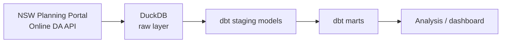

# Planning Pulse NSW

Planning Pulse NSW turns publicly available NSW Planning Portal development-application (DA) data into a reproducible, well-modeled analytics dataset. It explores DA volumes and decision timelines across Greater Sydney councils and development categories, built as an open, portfolio-quality data engineering and analytics project.

## Purpose

- Ingest DA records from the NSW Planning Portal's Online DA Data API into a local analytical database.
- Model the raw data into clean, documented, testable staging and mart layers using dbt.
- Support exploratory analysis of application volumes and decision timelines by council and development category.

This project is descriptive, not evaluative: it reports what is present in the published data. It does not attempt to rank council performance, infer causes of processing times, or draw equity conclusions from the data. See [Data caveats](#data-caveats) below for important limitations to keep in mind when interpreting any results.

## Data source

- **NSW Online DA Data API**: https://www.data.nsw.gov.au/data/dataset/online-da-data-api

## Intended architecture



- **Extraction**: Python scripts (`scripts/`) call the NSW Online DA Data API and land raw responses.
- **Storage**: [DuckDB](https://duckdb.org/) holds a raw layer close to the source API shape, plus staging and mart tables built by dbt.
- **Transformation**: [dbt](https://www.getdbt.com/) (`dbt_planning_pulse/`) models raw data into staging tables (cleaned, typed, one-to-one with source) and marts (aggregated, analysis-ready).
- **Analysis**: Notebooks or a lightweight dashboard query the marts to explore volumes and timelines.

A more detailed diagram and notes live in [`docs/architecture.md`](docs/architecture.md).

## Data caveats

- Council participation in the Online DA Data API became mandatory in **July 2021**. Data from before that date is likely incomplete, as it depends on voluntary adoption by individual councils, and comparisons across time periods spanning that boundary should be made cautiously.
- Coverage and data quality can vary by council and by period; absence of records does not necessarily mean absence of activity.
- Decision timelines reflect what is recorded in the portal and may be affected by data entry practices, application complexity, and process differences between councils. They should not be read as a measure of council performance or used to rank councils.

## Project status

This is an early iteration focused on repository scaffolding. No data has been downloaded and no models have been built yet.

## Roadmap (future iterations)

1. **Extraction scripts** — Python client for the Online DA Data API with pagination, rate limiting, and raw JSON/parquet landing in `data/raw`.
2. **Raw layer** — Load raw extracts into DuckDB with minimal transformation, preserving source fidelity.
3. **Staging models** — dbt models that clean, type, and standardize raw fields (councils, dates, application statuses, categories).
4. **Mart models** — Aggregated dbt marts for application volumes and decision timelines by council, category, and time period.
5. **Testing & documentation** — dbt tests (uniqueness, not-null, referential integrity) and generated dbt docs.
6. **Analysis layer** — Notebooks or a dashboard (e.g. Evidence, Streamlit, or Observable) presenting volumes and timelines with the caveats above surfaced alongside the data.
7. **Automation** — Scheduled refresh of the pipeline (deferred; no CI is configured in this iteration).

## Repository layout

```
data/
  raw/                          # Landed raw API extracts (not committed)
  processed/                    # Intermediate processed data (not committed)
dbt_planning_pulse/
  models/
    staging/                    # dbt staging models
    marts/                      # dbt mart models
scripts/                        # Python extraction/utility scripts
docs/                           # Project documentation, including architecture notes
```

## License

TBD.
